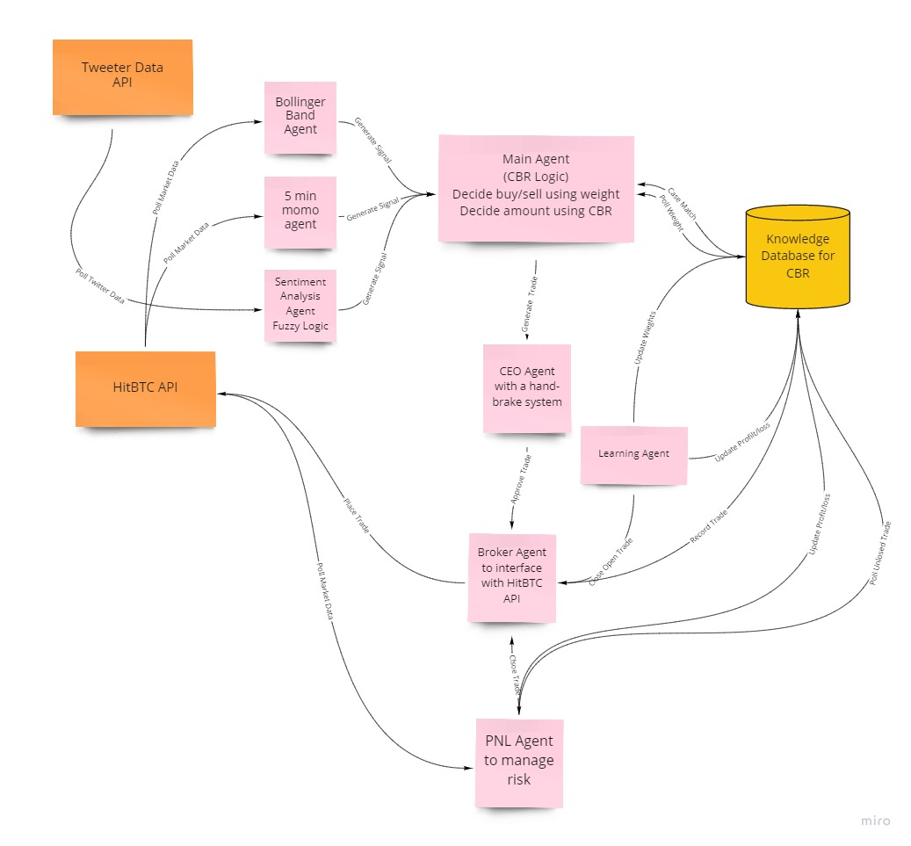

# IS5006 Final Group Project

[
[](https://github.com/arlandgoh)
[](https://www.python.org/)

## Multi-agent and Case-based Reasoning Algo Trading Systems

<p align="left">
    
</p>

This is a multi-agent and case-based reasoning system for algorithmic trading (multi-threading Flask server with multiple agents). This system allows user to get recommendation on whether buy/sell/hold a cryptocurrency in HitBTC exchange.

## Description
The manual of the final project of [IS5006 Intelligent Systems Deployment](https://drive.google.com/file/d/1P0G6ujiBn6GsEXasSgORsdnBm7O68_yV/view?usp=sharing) module at National University of Singapore.

We are tasked with designing and implementing a  system for **Algorithmic trading**. Given the highly complex and decentralized nature of the problem, a multi-agent system (MAS) design is a natural approach for building an efficient solution without requiring expert engineering. The goal of our system is to:
- make recommendation(s) on whether to buy or sell cryptocurrencies
- take action(s) based on the recommendation(s) etc.

<p align="center">
 <br />
<i>Multi-agents' decision flowchart</i>
</p>

## Quick Start
To run the system, please use the following command in your Terminal:
```
python3 run_simulation.py
```

## Documents
- [References](./documents/)
- [Assignment](./documents/)
- [Slides](./documents/) 

## API Reference
The official documentation can be found on the `HitBTC API reference page <https://api.hitbtc.com/>`_. You can also `explore the API <https://api.hitbtc.com/api/2/explore/>`_ using Swagger UI.

## Prerequisites
The first thing you need to do is to `Sign Up with HitBTC <https://hitbtc.com/signupapp>`_.

Next, you need to obtain an **API Key** and an **API Secret**. If you're writing code for your own HitBTC account, you can create API keys on `HitBTC API Settings <https://hitbtc.com/settings/api-keys>`_ page. You can create multiple API keys with different permissions for your applications.

NOTE: Make sure to enable appropriate permissions for the API key (some require email confirmation).

## Dependencies
Python 3.x: NumPy, Keras, pandas, jupyter, matplotlib, SciPy and etc. Please refer to [requirements.txt](./installation/requirements.txt) for more information.

## Tools
| Tool Name | Description | 
| --- | --- |
| `Google Drive and Sheets APIs` | Application programming interfaces (APIs) developed by Google which allow communication with Google Services and their integration to other services |
| `Google Colab` | a product from Google Research that allows anybody to write and execute arbitrary python code through the browser, and is especially well suited to machine learning, data analysis and education. |
| `Python Code` | an interpreted, high-level and general-purpose programming language |
| `PowerBI` | a business analytics service by Microsoft |
| `Zapier` | an online automation tool that connects your favorite apps, such as Gmail, Slack |
| `Github` | a code hosting platform for version control and collaboration |
| `StackEdit` | a free, open-source Markdown editor based on PageDown, the Markdown library used by Stack Overflow and the other Stack Exchange sites |
| `Miro` | an Online Visual Collaboration Platform |

## Contributors
- [Ge Xiaomeng](https://github.com/oliviaxm)
- [Goh Khai Hong](https://github.com/arlandgoh)
- [Shen Siyuan](https://github.com/Shensiyuan)
- [Xue Bin](https://github.com/jackyxuebin)
- [Yong Chee Xian Matthew](https://github.com/mattycx)
- [Zou Yang](https://github.com/zouyang)

### Disclaimer

DO NOT use this code to perform any live trading. For demo purpose only.

## Copyright

Copyright © 2021 Group 7.

Please review the [NUS regulations](https://www.nus.edu.sg/celc/programmes/plagiarism.html) governing Plagiarism in case you are a student at the NUS.
