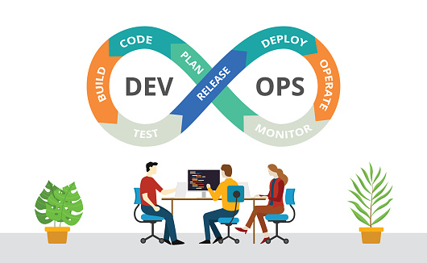

# IS5006 Final Group Project [Group 7]

[](https://join.slack.com/t/is5006group07-um22767/shared_invite/zt-og1rjuud-az7Q60clKRri5bs2gkJBKg)
[](https://github.com/arlandgoh)
[](https://www.python.org/)

This repository provides codes for [Group 7 Final Project](https://docs.google.com/spreadsheets/d/1lz79scscDoG9j-GIUKvt1KA83w_eNqn3bhGJ-PNGuJg/edit?usp=sharing)

## Multi-agent and Case-based Reasoning Algo Trading Systems

<p align="left">
    
</p>

## Abstract
Cryptocurrency trading strategies play a critical role in Algorithmic trading. However, it is challenging to design a consistent and profitable strategy in a complex and dynamic cryptocurrency market. In this project, we propose a ensemble strategy scheme that automatically learns a cryptocurrency trading strategies by maximizing investment return. We train 2 machine learning agents and use 3 other algorithmic agents to obtain an ensemble trading strategy using 5 different algorithms: Bollinger Band, Bollinger Band Trend, Double Duel Recurrent Q-learning agent, Deep evolution and Sentiment Analysis. The ensemble strategy inherits and integrates the best features of the three algorithms, thereby robustly adjusting to different market conditions. In order to avoid the large memory consumption in training networks with continuous action space, we employ a load-on-demand approach for processing very large data. We test our algorithms on the Bitcoin cryptocurrency which have adequate liquidity.

## Description
The manual of the final project of [IS5006 Intelligent Systems Deployment](https://drive.google.com/file/d/1P0G6ujiBn6GsEXasSgORsdnBm7O68_yV/view?usp=sharing) module at National University of Singapore.

We are tasked with designing and implementing a  system for **Algorithmic trading**. This is a multi-agent and case-based reasoning system for algorithmic trading (multi-threading Flask server with multiple agents). This system allows user to get recommendation on whether buy/sell/hold a cryptocurrency in HitBTC exchange. Given the highly complex and decentralized nature of the problem, a multi-agent system (MAS) design is a natural approach for building an efficient solution without requiring expert engineering. The goal of our system is to:
- make recommendation(s) on whether to buy or sell cryptocurrencies
- take action(s) based on the recommendation(s) etc.

<p align="center">
 <br />
<i>Multi-agents' decision flowchart</i>
</p>

## R&D Teams
In this final project, our group is divided into *TWO* teams, **Research Team and Development Team (DevOps)**, to make sure that each team can prioritize or fully focus on the assigned tasks in the area of interest hence the quality of works can be assured.

<p align="center">
 <br />
<i>Research and Development Teams</i>
</p>

Besides that, our Development Team adopts DevOps (methodolgy and principles) to work on our Multi-agent System (MAS) and make sure that the system is **production-ready**.

<p align="center">
 <br />
<i>DevOps Methodology and Process</i>
</p>

## Installation
Please refer to [installation](./installation/README.md) and [How To Guide](./Group07_How_To_Guide.pdf/) for more information.
```shell
git clone https://github.com/jackyxuebin/IS5006_Project.git
```

## Directories
| Directory Name | Description | 
| --- | --- |
| **app** | codes for setting up Flask Application and its configuration files |
| **config** | configuration files |
| **documents** | group project manual and other informative documents |
| **img** | images and figures which will be used in README.md |
| **installation** | system installation instructions and list of depencies/packages  |
| **local_db** | train/test dataset and other neccessary dataset e.g. tweet dataset |
| **log** | log data from the system/agents  |
| **model** | codes for training/testing of models and trained models |
| **multi-agents** | code repository for those agents in the system |
| **preprocessing** | functions/libraries which can be used to pre-process cyrptocurrency data |

## Quick Start
#### Ubuntu, Mac OS X and Windows 10
To run the system, please navigate to the project folder and use the following command in your command prompt/Terminal:
```
python3 run_simulation.py
```
or open the ‘run_simulation.py in Python IDE or any other IDE and run it. Please refer to [How To Guide](./Group07_How_To_Guide.pdf/) and [installation](./installation/README.md)  for more information.


## Start the Multi-agent System in Flask Server
#### Ubuntu, Mac OS X and Windows 10
To start the Flask Server, please use the following command in your command prompt/Terminal, the system will be served on port 7000:
```
python3 run_server.py
  ```  
or open the ‘run_simulation.py’ in Python IDE or any other IDE and run it. Please refer to [How To Guide](./Group07_How_To_Guide.pdf/) or [installation](./installation/README.md)  for more information.

## Documents
- [Write-up](./documents/)
- [Research](./documents/)
- [How To Guide](./Group07_How_To_Guide.pdf/)

## Video
The video for our final group project can be found [here](https://drive.google.com/drive/folders/1qwB3NnP4nCfUtphuvpyMvW-oCIxDZg0r?usp=sharing)

## API Reference
The official documentation can be found on the `HitBTC API reference page <https://api.hitbtc.com/>`_. You can also `explore the API <https://api.hitbtc.com/api/2/explore/>`_ using Swagger UI.

## Prerequisites
The first thing you need to do is to `Sign Up with HitBTC <https://hitbtc.com/signupapp>`_.

Next, you need to obtain an **API Key** and an **API Secret**. If you're writing code for your own HitBTC account, you can create API keys on `HitBTC API Settings <https://hitbtc.com/settings/api-keys>`_ page. You can create multiple API keys with different permissions for your applications.

NOTE: Make sure to enable appropriate permissions for the API key (some require email confirmation).

## Dependencies
The script has been tested running under Python >= 3.7.0, with the following packages installed:

```shell
pip install -r ./installation/requirements.txt
```

Please refer to [How To Guide](./Group07_How_To_Guide.pdf/) and [installation](./installation/README.md) for more information.

## Tools
| Tool Name | Description | 
| --- | --- |
| [**Google Drive and Sheets APIs**](https://console.cloud.google.com/apis/dashboard) | Application programming interfaces (APIs) developed by Google which allow communication with Google Services and their integration to other services |
| [**Google Colab**](https://colab.research.google.com/) | a product from Google Research that allows anybody to write and execute arbitrary python code through the browser, and is especially well suited to machine learning, data analysis and education. |
| [**Python Code**](https://www.python.org/) | an interpreted, high-level and general-purpose programming language |
| [**PowerBI**](https://powerbi.microsoft.com/en-us/) | a business analytics service by Microsoft |
| [**Zapier**](https://zapier.com/) | an online automation tool that connects your favorite apps, such as Gmail, Slack |
| [**Github**](https://github.com/) | a code hosting platform for version control and collaboration |
| [**StackEdit**](https://stackedit.io/) | a free, open-source Markdown editor based on PageDown, the Markdown library used by Stack Overflow and the other Stack Exchange sites |
| [**Miro**](https://miro.com/app/board/o9J_lMjDQjk=/) | an Online Visual Collaboration Platform |

## Contributors
- [Ge Xiaomeng](https://github.com/oliviaxm)
- [Goh Khai Hong](https://github.com/arlandgoh)
- [Shen Siyuan](https://github.com/Shensiyuan)
- [Xue Bin](https://github.com/jackyxuebin)
- [Yong Chee Xian Matthew](https://github.com/mattycx)
- [Zou Yang](https://github.com/zouyang)

## Disclaimer

DO NOT use this code to perform any live trading. For demo purpose only.

## Copyright

Copyright © 2021 Group 7.

This project is distributed under the <a href="LICENSE">GPL-3.0 License</a>. Please review the [NUS regulations](https://www.nus.edu.sg/celc/programmes/plagiarism.html) governing Plagiarism in case you are a student at the NUS.