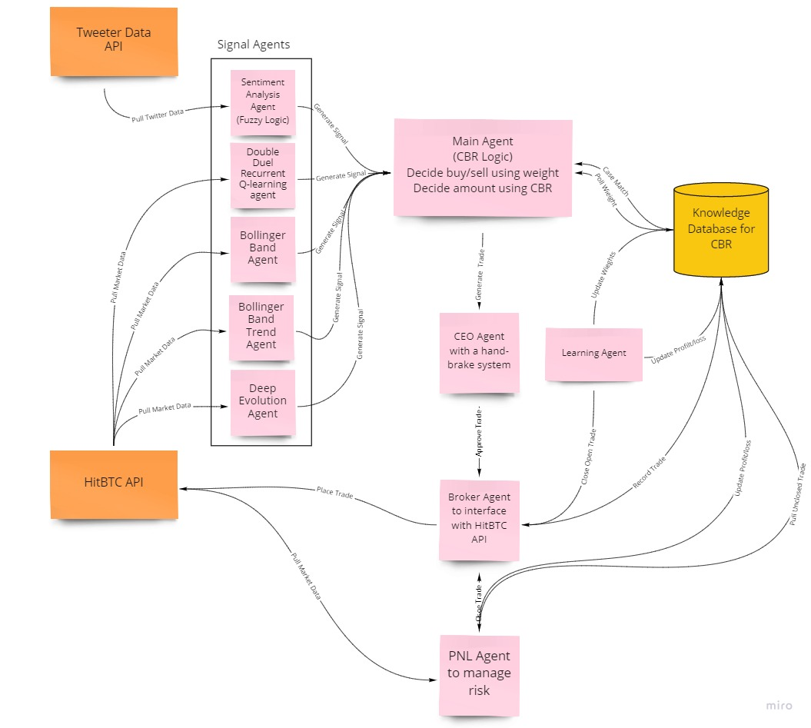

# IS5006 Final Group Project

## Description
The manual of the final project of [IS5006 Intelligent Systems Deployment](https://drive.google.com/file/d/1P0G6ujiBn6GsEXasSgORsdnBm7O68_yV/view?usp=sharing) module at National University of Singapore.

We are tasked with designing and implementing a  system for **Algorithmic trading**. Given the highly complex and decentralized nature of the problem, a multi-agent system (MAS) design is a natural approach for building an efficient solution without requiring expert engineering. The goal of our system is to:
- make recommendation(s) on whether to buy or sell cryptocurrencies
- take action(s) based on the recommendation(s) etc.

  
<i>Multi-agents' decision flowchart</i>

## Signal Generation Agent(Run every 5 minutes)
Input: Price 
Output: UP/DOWN 

## Decider Agent (Run every 5 minutes)
Attributes: 
1. Weight of each signal agent(initialize as 1) 

Logic: 
1. Take UP(+1)/DOWN(-1), compute a final decision using latest signals and weight 
2. Match this case in knowledge database and compute amount of buy/sell 
3. Place trade through CEO 

## Knowledge database
Attributes: 
Knowledge database 
Signal1 | signal2 | signal3 | signal4 | sigal5 | signal6 | decision | profit/loss 

Logic: 
1. Init - restores knowledge database from google sheet 
2. Create - creates an entry in the knowledge database 
3. Update - update the knowledge database with profit/loss 
4. Store - saves the knowledge database to google sheet 

## PNL Agent(Run every minutes)
1. Runs every minute to check any stoploss triggered for trades in our order book(risk control)
2. Close trade if risk control kicks in and update order book
3. Update knowledge database with profit/loss

## Learning Agent (Run every hour)
Logic
1. Check and close if any open trade from order book 
2. Update order book with profit/loss 
3. Update the knowldge database with profit/loss 
4. Update the weight of each signal agent based on historical profit/loss data 
5. Save order book, knowledge database, weight into google sheet

## CEO
1. Validate against priori rules of trade (Volume/Balance) 
2. Place order through broker agent 
3. Record order in order book 

## Order Book
Attributes: 
1. Order book 
OrderID | KnowldgeDBID | Symbol | Amount | Status | Profit/Loss 

Logic: 
1. Init - restores order book from google sheet 
2. Create - creates an entry in the order book 
3. Update - update the order book with profit/loss 
4. Store - saves the order book to google sheet 

## Broker
1. Check account balance
2. Place trade
3. Close trade

## Documents
- [References](./documents/)
- [Assignment](./documents/)
- [Slides](./documents/) 

## API Reference
The official documentation can be found on the `HitBTC API reference page <https://api.hitbtc.com/>`_. You can also `explore the API <https://api.hitbtc.com/api/2/explore/>`_ using Swagger UI.

## Prerequisites
The first thing you need to do is to `Sign Up with HitBTC <https://hitbtc.com/signupapp>`_.

Next, you need to obtain an **API Key** and an **API Secret**. If you're writing code for your own HitBTC account, you can create API keys on `HitBTC API Settings <https://hitbtc.com/settings/api-keys>`_ page. You can create multiple API keys with different permissions for your applications.

NOTE: Make sure to enable appropriate permissions for the API key (some require email confirmation).

## Dependencies
Python 3.x: NumPy, Keras, pandas, jupyter, matplotlib, SciPy and etc. Please refer to [requirements.txt](./installation/requirements.txt) for more information.

## Tools
1. **Google Drive and Sheets APIs**: application programming interfaces (APIs) developed by Google which allow communication with Google Services and their integration to other services
2. **Python Code**: an interpreted, high-level and general-purpose programming language
3. **PowerBI**: a business analytics service by Microsoft
4. **Zapier**: an online automation tool that connects your favorite apps, such as Gmail, Slack
5. **Github**: a code hosting platform for version control and collaboration
6. **StackEdit**: a free, open-source Markdown editor based on PageDown, the Markdown library used by Stack Overflow and the other Stack Exchange sites
7. **Miro**:an Online Visual Collaboration Platform

## Contributors
- [Ge Xiaomeng](https://github.com/oliviaxm)
- [Goh Khai Hong](https://github.com/arlandgoh)
- [Shen Siyuan](https://github.com/Shensiyuan)
- [Xue Bin](https://github.com/jackyxuebin)
- [Yong Chee Xian Matthew](https://github.com/mattycx)
- [Zou Yang](https://github.com/zouyang)

## Copyright

Copyright © 2021 Group 7.